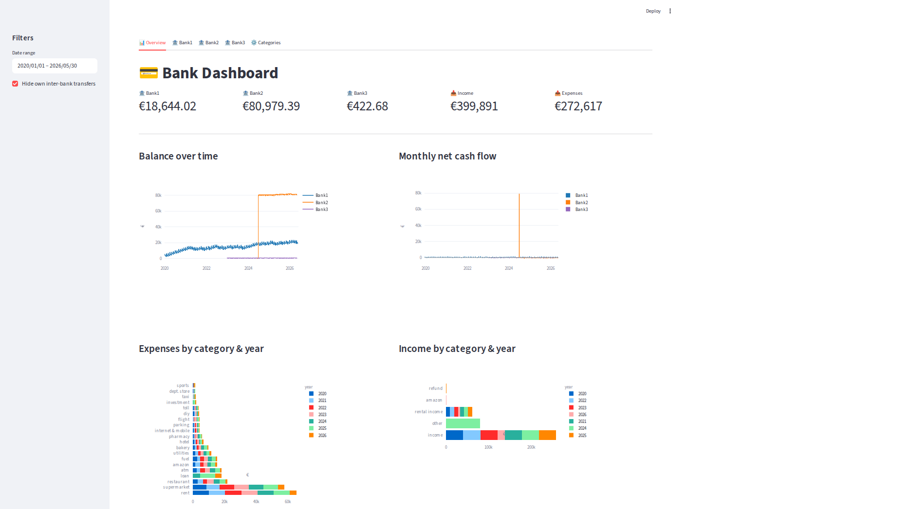
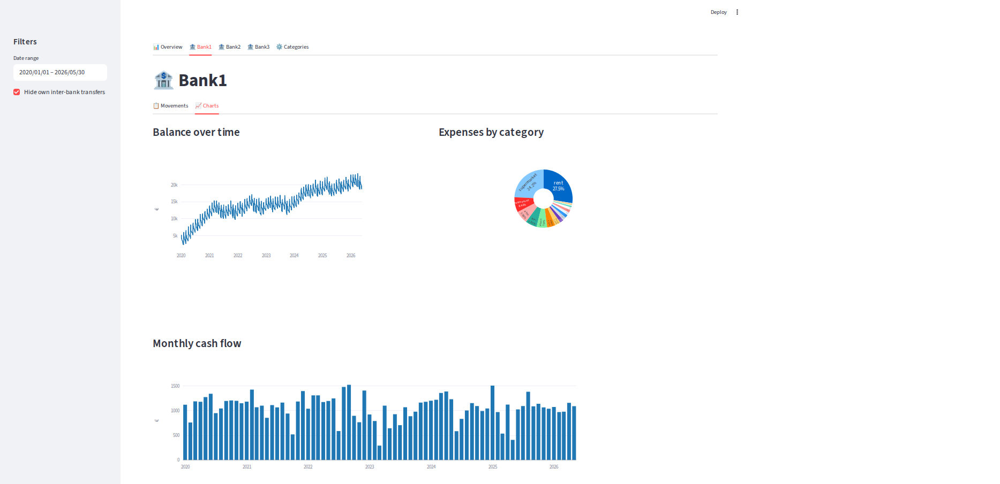
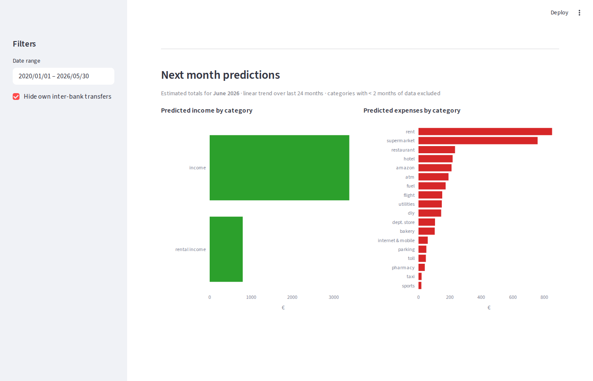
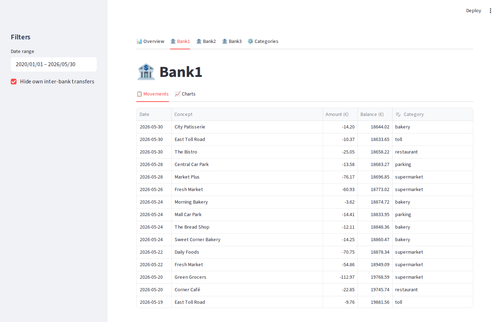
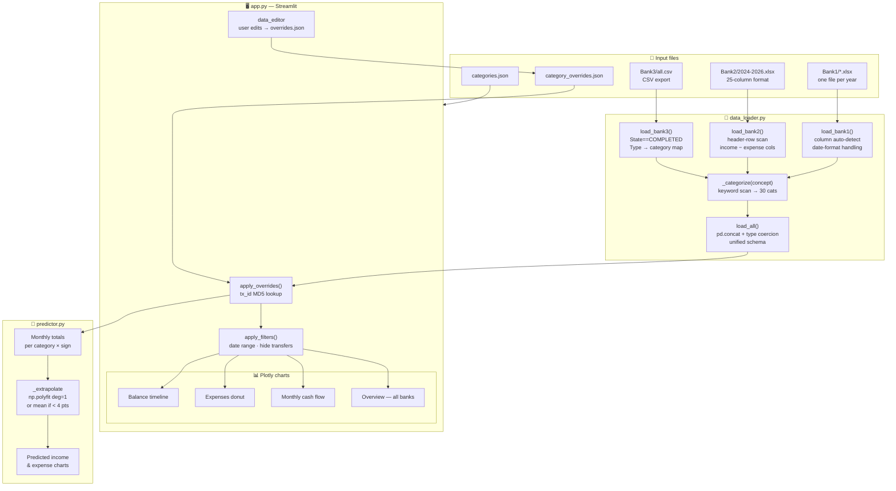

# Bank Accounting Dashboard

A personal finance dashboard that consolidates movements from multiple bank accounts into a single interactive view — with automatic categorisation, persistent user overrides, and ML-powered next-month predictions.

Built with **Python · Pandas · Streamlit · Plotly · NumPy**.

 

---

## Screenshots

### Overview — balance timeline & monthly cash flow across all banks


### Per-bank view — balance over time & expenses by category


### Per-bank next-month predictions — income & expenses by category


### Per-bank movements table — editable category per row


---

## Features

- **Multi-bank support** — loads data from three banks with different file formats:
  - Bank1: one `.xlsx` file per year
  - Bank2: single multi-column `.xlsx` export (25 columns, split income/expense)
  - Bank3: single `.csv` export
- **Automatic format detection** — column names are detected by keyword so new exports work without code changes
- **Per-bank tabs** with:
  - Movements table with an editable **Category dropdown** per row
  - Balance over time, expense pie chart, monthly cash flow
  - **Next-month predictions** — predicted income and expenses by category using a linear-trend ML model trained on the last 24 months of data
- **Overview tab** — combined balance timeline, monthly net flow, expense & income breakdowns by year
- **Persistent category overrides** — manual category assignments are saved to disk and survive restarts
- **Category manager** — add or remove spending categories from the UI

---

## Quick start

```bash
# 1. Install dependencies
pip install streamlit pandas plotly openpyxl xlrd numpy

# 2. Generate dummy data (or drop your real files into Bank1/, Bank2/, Bank3/)
python generate_dummy_data.py

# 3. Run the dashboard
streamlit run app.py
```

Open http://localhost:8501 in your browser.

---

## Project structure

```
├── app.py                   # Streamlit dashboard
├── data_loader.py           # Data loading & normalisation for all three banks
├── predictor.py             # ML next-month predictions per category (linear trend)
├── generate_dummy_data.py   # Generates realistic sample data for demo
├── categories.json          # Editable list of spending categories
├── category_overrides.json  # User-assigned category overrides (auto-created, gitignored)
├── Bank1/                   # Bank1 data: one xlsx per year
├── Bank2/                   # Bank2 data: one xlsx covering multiple years
└── Bank3/                   # Bank3 data: all.csv
```

---

## Data processing pipeline

### 1 — Ingestion: bank-specific loaders (`data_loader.py`)

Each bank exports data in a different format. A dedicated loader handles each one:

| Loader | Source | Format details |
|---|---|---|
| `load_bank1()` | `Bank1/*.xlsx` | One file per year. Columns detected by keyword (`fecha`, `concepto`, `importe`, `saldo`). Date format varies: `MM/DD/YYYY` for 2020, `DD/MM/YYYY` for all later files. |
| `load_bank2()` | `Bank2/*.xlsx` | Single file spanning multiple years. Two layouts are handled: a 25-column modern format with separate income/expense columns, and an older 6-column format. The header row is located dynamically by scanning for keyword markers. |
| `load_bank3()` | `Bank3/all.csv` | CSV export. Only `State == "COMPLETED"` rows are kept. The `Type` column (Topup, ATM, Card Refund, Exchange) is used to assign categories directly, bypassing keyword matching. |

### 2 — Normalisation (`load_all()`)

After loading, all three DataFrames are concatenated into a single unified schema:

| Column | Type | Description |
|---|---|---|
| `date` | `datetime64` | Transaction date, timezone-naive |
| `concept` | `str` | Merchant name or transaction description |
| `amount` | `float` | EUR amount — positive for income, negative for expense |
| `balance` | `float` | Account balance after the transaction |
| `bank` | `str` | Source bank identifier (`Bank1`, `Bank2`, `Bank3`) |
| `category` | `str` | Spending category |

### 3 — Categorisation (`_categorize()`)

Every transaction concept is matched against an ordered list of keyword rules. The first matching rule wins and assigns the category; unmatched transactions fall back to `"other"`. The 30 built-in categories cover everything from `supermarket` and `restaurant` to `investment`, `loan`, and `rental income`.

A **transaction ID** (`tx_id`) is computed as an MD5 hash of `bank | date | concept | amount`. This stable identifier lets user-assigned category overrides survive across re-imports: overrides are persisted in `category_overrides.json` and re-applied on top of the auto-categorisation every time the app loads.

### 4 — Filtering & aggregation (`app.py`)

`apply_filters()` restricts the DataFrame to the sidebar date range and, optionally, hides own inter-bank transfers. The filtered data is then aggregated in memory for each chart:

- **Balance over time** — last balance per calendar day (step-function line chart)
- **Expenses by category** — absolute sum of negative amounts grouped by category (donut)
- **Monthly cash flow** — net sum of all amounts grouped by calendar month (bar chart)
- **Overview breakdowns** — same aggregations across all banks simultaneously

### 5 — ML predictions (`predictor.py`)

`predict_next_month(df)` is called once per bank tab with the bank's full unfiltered history and returns predicted income and expense totals for each category for the coming month. See the [Machine Learning model](#machine-learning-model) section for full details.

---

## Architecture & data flow



---

## Libraries

| Library | Role in this project |
|---|---|
| **[Streamlit](https://streamlit.io/)** | Turns a plain Python script into an interactive web app. Provides tabs, sidebar filters, the editable data table, and the reactive re-run model — no HTML or JavaScript needed. |
| **[Pandas](https://pandas.pydata.org/)** | Core data manipulation layer. Used for reading Excel/CSV files, concatenating multi-bank DataFrames, `groupby` aggregations for charts, period-based resampling, and applying category overrides via row-level lookups. |
| **[Plotly Express](https://plotly.com/python/plotly-express/)** | Interactive chart library. All charts (line, bar, donut/pie, horizontal bar) are rendered with Plotly and embedded in Streamlit. Hover tooltips and zoom come for free. |
| **[NumPy](https://numpy.org/)** | Numerical backbone of the prediction module. `np.polyfit` fits the least-squares linear model; `np.arange` generates the time index. No heavy ML framework is needed. |
| **[openpyxl](https://openpyxl.readthedocs.io/)** | Reads modern `.xlsx` files (Bank1 yearly exports, Bank2 multi-year export). Used transparently by `pd.read_excel`. |
| **[xlrd](https://xlrd.readthedocs.io/)** | Reads legacy `.xls` files. Some bank exports still use the older binary format; `xlrd` handles those transparently alongside `openpyxl`. |
| **hashlib** *(stdlib)* | Generates the stable MD5 `tx_id` per transaction so that user category overrides survive data re-imports without a database. |
| **pathlib** *(stdlib)* | Cross-platform file path handling for locating bank data folders and JSON config files relative to the script location. |
| **json** *(stdlib)* | Reads and writes `categories.json` and `category_overrides.json` — the two persistence files that survive app restarts. |

---

## Machine Learning model

### Algorithm — Ordinary Least Squares linear regression (`np.polyfit`, degree 1)

For each `(bank, category, sign)` triplet — e.g. *Bank1 / supermarket / expense* — the predictor:

1. Collects all **completed calendar months** in the last `LOOKBACK_MONTHS = 24` months where that category had at least one transaction.
2. Computes the **monthly total** for that category (income and expenses are treated separately).
3. Fits a **degree-1 polynomial** (straight line) to those totals using `np.polyfit`, which minimises the sum of squared residuals — equivalent to Ordinary Least Squares regression with a single time-index feature.
4. **Extrapolates one step ahead**: the predicted value is `slope × (n + 1) + intercept`, clamped to zero to prevent negative predictions.
5. If fewer than `TREND_MIN = 4` months of data exist for the category, the model falls back to the **arithmetic mean** — a sensible prior when there is too little evidence for a trend.

### Why linear regression?

| Property | Benefit for this use case |
|---|---|
| **No external ML dependency** | Only NumPy is required — already a transitive dependency of Pandas. |
| **Interpretable** | The slope directly expresses whether spending is growing or shrinking in euros per month. |
| **Low data requirement** | Works with as few as 4 monthly observations — important for categories like `flight` or `hotel` that appear rarely. |
| **Robust to irregular cadence** | Because the input is a pre-aggregated monthly total rather than raw daily amounts, daily noise is averaged out before fitting. |
| **No overfitting risk** | A single-parameter linear model cannot overfit a short time series, which is the dominant risk with personal finance data (small N, high variance). |

More complex models (ARIMA, Prophet, LSTM) would require substantially more historical data per category, hyperparameter tuning, and additional dependencies, with limited accuracy gain on a dataset of this size.

### Parameters

| Parameter | Value | Effect |
|---|---|---|
| `LOOKBACK_MONTHS` | `24` | Training window. Keeps predictions recent; drops data older than 2 years. |
| `MIN_MONTHS` | `2` | Minimum monthly data points to produce any prediction for a category. |
| `TREND_MIN` | `4` | Minimum points to fit a trend line; below this the mean is used instead. |
| `deg` | `1` | Polynomial degree passed to `np.polyfit` — enforces a straight-line fit. |

---

## Adding your own bank data

Replace the files in `Bank1/`, `Bank2/`, `Bank3/` with your real exports.
The loaders detect column names automatically, so minor format variations (different column names, date formats) are handled without code changes.

To add a fourth bank, add a new loader function in `data_loader.py` following the same pattern and include it in `load_all()`.

---

## Data privacy

The `Bank1/`, `Bank2/`, `Bank3/` folders in this repository contain **synthetic dummy data** generated by `generate_dummy_data.py`. No real financial data is included.

---

## Auditing

This section provides a structured checklist for review by an IT expert and a personal-finance subject-matter expert.

### Audit Items

- **Cost & resource minimization** — The project runs entirely locally with no cloud services, APIs, or paid libraries. Monthly cost is $0.
- **IT architecture** — Clean three-file separation (`data_loader.py`, `predictor.py`, `app.py`). Streamlit is appropriate for a personal, single-user dashboard. No over-engineering for the stated use case.
- **Code efficiency** — MD5 is used for `tx_id` generation; adequate for personal finance but not collision-resistant at scale. The full dataset reloads on every Streamlit interaction (no persistent server state), which is acceptable for a few thousand transactions.
- **Cybersecurity** — Real bank files are handled locally and never uploaded. Dummy data is committed to the repo. The Streamlit dashboard has no authentication — anyone with localhost access can view all financial data. `category_overrides.json` is gitignored.
- **Readability & maintainability** — The 30-category keyword list in `_categorize()` may become hard to maintain as spending habits change. The loader's keyword-based column detection is a practical approach but fragile if bank export formats change significantly.
- **ML / predictive model adequacy** — OLS linear regression (`np.polyfit`, degree 1) is simple, interpretable, and well-suited to a personal dataset of this size. The graceful fallback to arithmetic mean for categories with fewer than 4 data points prevents overfitting on sparse data.
- **Data privacy** — Financial data remains strictly local. No data is transmitted to external services. The dummy data generator ensures the repo contains no real transaction information.
- **Other** — No input validation on bank export file formats; future format changes by banks may silently produce wrong results. The 24-month lookback window (`LOOKBACK_MONTHS`) may exclude relevant historical context for infrequent spending categories.

### Summary Table

| Audit Item | Claude's Assessment | Human Expert Assessment |
|---|---|---|
| Cost & resource minimization | $0/month. No cloud dependencies. Optimal for a personal-use tool. | |
| IT architecture | Clean separation of concerns. Streamlit is appropriate. No unnecessary complexity. | |
| Code efficiency | MD5 tx_id is adequate. Full reload per interaction is acceptable at this data volume. | |
| Cybersecurity | No authentication on dashboard. Real data stays local. No cloud transmission. | |
| Readability & maintainability | 30-category keyword list may drift from reality. Bank format detection is pragmatic but fragile. | |
| ML / predictive model adequacy | Linear regression with mean fallback is the right level of complexity for personal finance. | |
| Data privacy | Financial data never leaves the local machine. Repo contains only synthetic data. | |
| Other | No format-change detection for bank exports. Infrequent categories may have insufficient history for trend detection. | |
